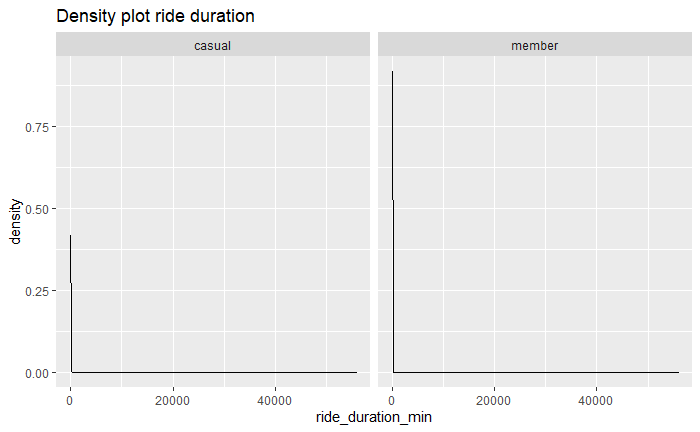
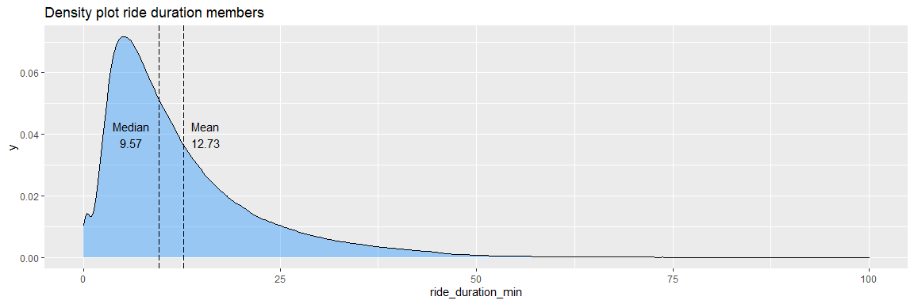

# Analyze

Just as a reminder, the business task is the following:

How do annual members and casual riders use Cyclistics bikes differently?

## Basic information

Fist some basic analysis will be done, starting with the split in number of rides per member and casual rider as well as the number of minutes on the bike.

### Number of rides
```{r pie_number_of_rides}
df <- bike_rides_2021 %>% 
  group_by(member_casual) %>% 
  tally(name = "number_of_rides") %>% 
  mutate(percentage = round(number_of_rides / sum(number_of_rides), digits = 2)) %>% 
  arrange(-percentage) %>% 
  mutate(labels = scales::percent(percentage))

ggplot(df, aes(x = "", y = percentage, fill = member_casual)) +
  geom_col(color = "white") +
  geom_text(aes(label = labels),
            position = position_stack(vjust = 0.5)) +
  coord_polar(theta = "y") +
  theme_void() + 
  labs(title = "Rides [5,585,206] per customer type") +
  guides(fill = guide_legend(title = "Member type"))
```


### Number of minutes on bike

```{r}
df <- bike_rides_2021 %>% 
  group_by(member_casual) %>% 
  summarise(minutes_on_bike = sum(ride_duration_min)) %>% 
  mutate(percentage = minutes_on_bike / sum(minutes_on_bike)) %>%
  arrange(percentage) %>% 
  mutate(labels = scales::percent(percentage))

ggplot(df, aes(x = "", y = percentage, fill = member_casual)) +
  geom_col(color = "white") +
  geom_text(aes(label = labels),
            position = position_stack(vjust = 0.5)) +
  coord_polar(theta = "y") +
  theme_void() + 
  labs(title = "Minutes [116.5 million] per customer type") +
  guides(fill = guide_legend(title = "Member type"))
```


#### Conclusions
* Members make more rides than casual riders
* Casual riders spend more minutes on the bike then members

## Starting the bike ride

When do the different customer types start their bike ride? On which day and hour? This section will dive into the when the ride was started.

### Day of the bike ride

Plotting the starting day in a bar graph. Week days need to be in a vector to make sure that the bar graoh shows the week days in the correct order.

```{r number_rides_week_day}
week_days <- c("Monday", "Tuesday", "Wednesday", "Thursday", "Friday", "Saturday", "Sunday")

bike_rides_2021 %>%
  ggplot() +
  geom_bar(mapping = aes(x = factor(week_day_started, level = week_days))) +
  facet_wrap(~member_casual) +
  theme(axis.text.x = element_text(angle = 45, hjust = 1)) +
  labs(title = "Number of bike rides", x = "Weekday", y = "Number of rides")
```


### Starting hour of the bike ride

Since there is a clear distinction between the week and the weekend the starting hours are separately plotted by week and weekend.

```{r fig.width=12,fig.height=4}

df <- bike_rides_2021 %>% 
  count(member_casual, hour_started, weekend, name = "number_bike_rides")

ggplot(data = df, aes(x = hour_started, y = number_bike_rides)) +
  geom_line(aes(color = member_casual)) +
  scale_x_continuous(breaks = seq(0, 23, by = 1)) +
  scale_y_continuous(labels = comma) +
  facet_wrap(~weekend) +
  labs(title = "Number of bike rides", color = "Member type")

```


### Starting hour during the week

Analysis of the starting hour during the week displayed per day

```{r fig.width=12,fig.height=4}
df <- bike_rides_2021 %>% 
  filter(week_day_started != "Saturday" & week_day_started != "Sunday") %>% 
  count(member_casual, week_day_started, hour_started, name = "number_bike_rides")

ggplot(data = df, aes(x = hour_started, y = number_bike_rides)) +
  geom_line(aes(color = week_day_started)) + 
  scale_x_continuous(breaks = seq(0, 23, by = 1)) +
  scale_y_continuous(labels = comma) +
  labs(title = "Number of bike rides during work week") +
  facet_wrap(~member_casual)
```


No significant observations besides some preferences in days can be found. Casual riders ride a bit more on Friday during the week. Member riders show a slight preference on Tuesday and Wednesday. 

### Starting hour during the weekend

Analysis of the starting hour during the weekend displayed per day

```{r fig.width=12,fig.height=4}
df <- bike_rides_2021 %>% 
  filter(week_day_started == "Saturday" | week_day_started == "Sunday") %>% 
  count(member_casual, week_day_started, hour_started, name = "number_bike_rides")

ggplot(data = df, aes(x = hour_started, y = number_bike_rides)) +
  geom_line(aes(color = week_day_started)) + 
  scale_x_continuous(breaks = seq(0, 23, by = 1)) +
  scale_y_continuous(labels = comma) +
  labs(title = "Number of bike rides during weekend") +
  facet_wrap(~member_casual)
```


No significant observations besides both the casual and member riders show a slight increase in rides on Saturday.

### Starting month 

```{r}
df <- bike_rides_2021 %>% 
  mutate(month_started = month(started_at)) %>% 
  count(member_casual, month_started, name = "number_bike_rides")

ggplot(data = df, aes(x = month_started, y = number_bike_rides)) +
  geom_line(aes(color = member_casual)) +
  scale_x_continuous(breaks = seq(0, 23, by = 1)) +
  scale_y_continuous(labels = comma) +
  labs(title = "Number of bike rides per month")
```


Member riders show that they ride longer throughout autumn. Where we see a sharp decrease in the casual riders when the weather turns for the worse. During the winter season there are a lot less bike rides especially for the casual riders. Membership riders also start earlier with riding in the beginning of the year. Casual riders show more rides during the summer period. Winters are often cold -10 C with snow. 

### Conclusions
* Casual riders make more rides during the weekend (including Friday)
* Member riders make less rides on Sunday and Monday than on average
* Member riders show clear morning and evening rush hour peaks during the week
* Casual riders only show a peak during the evening rush hour
* Member riders ride more during the week
* Casual riders rider more during the weekend
* Casual and member riders show similar riding patterns during the weekend
* Member riders ride more in the colder months whereas the casual rider likes the warmer months

## Ride duration

### Density plots

Plotting a density chart with the ride duration data shows that there are a few outliers that prevent the plot from being rendered correctly.



Filtering out rides that take more than 100 minutes gives a better plot.

```{r fig.width=12,fig.height=4}
df <- bike_rides_2021 %>%
  filter(ride_duration_min < 100)

ggplot(data = df, aes(x = ride_duration_min, fill = member_casual)) +
  geom_density(alpha=0.4) +
  facet_wrap(~member_casual)
```


Looking at the longer bike rides shows the following

```{r}
long_bike_rides <- bike_rides_2021 %>% 
  filter(ride_duration_min >= 100) %>% 
  group_by(member_casual) %>% 
  tally(name = "number_of_rides") %>% 
  mutate(percentage = percent(number_of_rides / sum(number_of_rides)), 
         percentage_total_rides = percent(number_of_rides / nrow(bike_rides_2021)))
```


Roughly 1.5% of all bike rides are longer than 100 minutes, where 92% of those longer rides are performed by casual rides. Although members are incentivized to stop their ride after 45 minutes ($0,15 cent per minute after 45 min), about 1% of their rides are longer than 45 minutes. Casual riders need to pay the 15 cents after 30 minutes, which is about 11% of their rides. But since there are also day passes available, and this information is not available in the data set, we cannot draw any conclusions from this.

### Average ride duration

Since there are some outliers with a very long ride duration it is important to see what the effect is on the mean and median of the data. We already saw that the data is positively skewed. Looking at the plots below we can see that the median is a better representation of the "average" than the mean. So th casual riders have an "average"" of 15 minutes per ride where as the members have an "average" of 10 minutes.

```{r casual riders fig.width=12,fig.height=4}
df <- bike_rides_2021 %>% 
  filter(ride_duration_min < 100, member_casual == "casual")

mean_casual_min <- df %>% 
  pull(ride_duration_min) %>% 
  mean() %>% 
  round(2)

median_casual_min <- df %>% 
  pull(ride_duration_min) %>% 
  median() %>%
  round(2)

ggplot(data = df, aes(x = ride_duration_min)) +
  geom_density(alpha=0.4, fill = "dodgerblue") +
  labs(title = "Density plot casual riders") +
  geom_vline(xintercept = mean_casual_min, linetype = "longdash") +
  geom_vline(xintercept = median_casual_min, linetype = "longdash") +
  annotate("text", x=24, y=0.025, label= paste0("Mean\n",mean_casual_min)) +
  annotate("text", x=12, y=0.025, label= paste0("Median\n",median_casual_min)) +
  labs(title = "Density plot ride duration casual")
```


```{r casual riders fig.width=12,fig.height=4}
df <- bike_rides_2021 %>% 
  filter(ride_duration_min < 100, member_casual == "member")

mean_member_min <- df %>% 
  pull(ride_duration_min) %>% 
  mean() %>% 
  round(2)

median_member_min <- df %>% 
  pull(ride_duration_min) %>% 
  median() %>%
  round(2)

ggplot(data = df, aes(x = ride_duration_min)) +
  geom_density(alpha=0.4, fill = "dodgerblue") +
  labs(title = "Density plot member riders") +
  geom_vline(xintercept = mean_member_min, linetype = "longdash") +
  geom_vline(xintercept = median_member_min, linetype = "longdash") +
  annotate("text", x=15.5, y=0.04, label= paste0("Mean\n",mean_member_min)) +
  annotate("text", x=6, y=0.04, label= paste0("Median\n",median_member_min)) +
  labs(title = "Density plot ride duration members")
```


### Conclusions
* 92% of the rides longer than 100 minutes are performed by casual riders
* On "average" casual members spend 15 minutes on a bike compared to 10 minutes for a member

## Type of ride

First an analysis of bike type per member type.

```{r bikes_per_member_type}
df <- bike_rides_2021 %>% 
  group_by(member_casual, rideable_type) %>% 
  tally(name = "number_of_rides") %>% 
  mutate(percentage = round(number_of_rides / sum(number_of_rides), digits = 2)) %>% 
  arrange(-percentage) %>% 
  mutate(labels = scales::percent(percentage))

ggplot(df, aes(x = "", y = percentage, fill = rideable_type)) +
  geom_col(color = "white") +
  geom_text(aes(label = labels),
            position = position_stack(vjust = 0.5)) +
  coord_polar(theta = "y") +
  theme_void() + 
  labs(title = "Rideable types per member type") +
  guides(fill = guide_legend(title = "Rideable type")) +
  facet_wrap(~ member_casual)
```


We can see that both rider types use an electric bike for roughly the same percentage of their rides. Casual riders are the only ones that use docked_bikes. This amounts to 12% of their total bike rides. Member riders do not use docked_bikes.

## What is a docked bike?

A quick analysis shows no clear indications of what a docked bike might be. The internet doed not provide any information, so the Chicago data portal was contacted to provide more information.

### Conclusions
* Members do not use docked_bikes, whereas 12% of the rides of casual riders used docked bikes
* Members and casual rides use an electric bike for roughly the same percentage of their rides

## Geographic investigation

### what are the most popular stations are where are they located

Finding the most popular start stations

```{r pop_start_stations}
start_station_gps <- bike_rides_2021 %>% 
  filter(start_station_name != "") %>% 
  group_by(station_id = start_station_id, station_name = start_station_name) %>% 
  summarise(lng = mean(start_lng), lat = mean(start_lat))

most_pop_start_station_casual <- bike_rides_2021 %>% 
  filter(start_station_name != "", member_casual == "casual") %>% 
  group_by(station_name = start_station_name, member_casual) %>% 
  tally(name = "number_of_starts") %>%
  left_join(start_station_gps, by = "station_name") %>% 
  arrange(-number_of_starts)

most_pop_start_station_casual <- most_pop_start_station_casual[1:10,]

most_pop_start_station_member <- bike_rides_2021 %>% 
  filter(start_station_name != "", member_casual == "member") %>% 
  group_by(station_name = start_station_name, member_casual) %>% 
  tally(name = "number_of_starts") %>%
  left_join(start_station_gps, by = "station_name") %>% 
  arrange(-number_of_starts)

most_pop_start_station_member <- most_pop_start_station_member[1:10,]

most_pop_start_station <- rbind(most_pop_start_station_casual, most_pop_start_station_member)

```
Finding the most popular end stations

```{r pop_end_stations}
end_station_gps <- bike_rides_2021  %>% 
  filter(end_station_name != "") %>% 
  group_by(station_name = end_station_name) %>% 
  summarise(lng = mean(end_lng), lat = mean(end_lat))

most_pop_end_station_casual <- bike_rides_2021 %>% 
  filter(end_station_name != "", member_casual == "casual") %>% 
  group_by(station_name = end_station_name, member_casual) %>% 
  tally(name = "number_of_starts") %>%
  left_join(end_station_gps, by = "station_name") %>% 
  arrange(-number_of_starts)

most_pop_end_station_casual <- most_pop_end_station_casual[1:10,]

most_pop_end_station_member <- bike_rides_2021 %>% 
  filter(end_station_name != "", member_casual == "member") %>% 
  group_by(station_name = end_station_name, member_casual) %>% 
  tally(name = "number_of_starts") %>%
  left_join(end_station_gps, by = "station_name") %>% 
  arrange(-number_of_starts)

most_pop_end_station_member <- most_pop_end_station_member[1:10,]

most_pop_end_station <- rbind(most_pop_end_station_casual, most_pop_end_station_member)
```

Plotting the most popular start and end stations

Start                      |  End
:-------------------------:|:-------------------------:
  |  

It is clearly visible that the most popular start and end stations are virtually the same. Furthermore, it is noticeable that under casual riders the tourist attractions(the pier, musea and parks ) are under the most popular stations. For member riders residential area's as well as office area's are popular.

### What number of trips started or ended at the same station

```{r round_trips}
round_trip <- bike_rides_2021 %>% 
  mutate(roundtrip_openended = case_when(distance_between_stations_km == 0 ~ "round_trip", 
                             TRUE ~ "open_ended")) %>% 
  group_by(member_casual, roundtrip_openended) %>% 
  tally(name = "number_of_trips") %>% 
  mutate(percentage = round(number_of_trips / sum(number_of_trips), digits = 2)) %>% 
  arrange(-percentage) %>% 
  mutate(labels = percent(percentage))

ggplot(round_trip, aes(x = "", y = percentage, fill = roundtrip_openended)) +
  geom_col(color = "white") +
  geom_text(aes(label = labels),
            position = position_stack(vjust = 0.5)) +
  coord_polar(theta = "y") +
  theme_void() + 
  labs(title = "Open ended vs round trips") +
  guides(fill = guide_legend(title = "Type of ride")) +
  facet_wrap(~ member_casual)
```


It is visible that the casual riders have more round trips but the overall majority for but users are open ended trips.

### Distance between stations

There is one trip of an electric bike by a casual rider that really stands out. It traveled a whopping 115 km, most probable by car. I could not find any trips in the region that suggest rides in the neighbourhood and since no bike identification is present it is impossible to see what happened to the bike. This effect is more present with the casual members caused by the higher amount of round trips.

Furthermore, in this plot is visible that member riders are travelling shorter distances than casual riders. This coincides with their average time on the bike.


Plotting the density of the distance between stations

```{r fig.width=12,fig.height=4}
df <- bike_rides_2021 %>%
  filter(distance_between_stations_km < 10)

ggplot(data = df, aes(x = distance_between_stations_km, fill = member_casual)) +
  geom_density(alpha=0.4) +
  facet_wrap(~member_casual) + 
    labs(title = "Density plot distance between stations")
```


It is noticeable that in both graphs there is a high number of low distance trips(round trips or near round trips due to docking availability)

The median and mean values for the distance are as follows:

```{r mean_median_casual_distance}
mean_casual_distance_min <- bike_rides_2021 %>%
  filter(member_casual == "casual") %>% 
  pull(distance_between_stations_km) %>% 
  mean() %>% 
  round(2)

median_casual_distance_min <- bike_rides_2021 %>%
  filter(member_casual == "casual") %>% 
  pull(distance_between_stations_km) %>% 
  median() %>%
  round(2)
```
Casual mean = 2.26 km
<br>Casual median = 1.73 km

```{r mean_median_member_distance}
mean_member_distance_min <- bike_rides_2021 %>%
  filter(member_casual == "member") %>% 
  pull(distance_between_stations_km) %>% 
  mean() %>% 
  round(2)

median_member_distance_min <- bike_rides_2021 %>%
  filter(member_casual == "member") %>% 
  pull(distance_between_stations_km) %>% 
  median() %>%
  round(2)
```

Member mean = 2.13 km
<br>Member median = 1.56 km

Looking at the average figures we can safely state that member riders have shorter rides than member riders.
### Conclusions
* Casual riders focus on stations the offer tourist/leisure activities
* Member riders focus on station in residential and office locations
* Casual riders have more round trips than members
* Member riders have shorter trips than casual riders

## Conclusions

At the end of the analysis the following conclusions can be drawn.

* Members make more rides than casual riders
* Casual riders spend more minutes on the bike then members
* Casual riders make more rides during the weekend (including Friday)
* Member riders make less rides on Sunday and Monday than on average
* Member riders show clear morning and evening rush hour peaks during the week
* Casual riders only show a peak during the evening rush hour
* Member riders ride more during the week
* Casual riders rider more during the weekend
* Casual and member riders show similar riding patterns during the weekend
* Member riders ride more in the colder months whereas the casual rider likes the warmer months
* 92% of the rides longer than 100 minutes are performed by casual riders
* On "average" casual members spend 15 minutes on a bike compared to 10 minutes for a member
* Members do not use docked_bikes, whereas 12% of the rides of casual riders used docked bikes
* Members and casual rides use an electric bike for roughly the same percentage of their rides
* Casual riders focus on stations the offer tourist/leisure activities
* Member riders focus on station in residential and office locations
* Casual riders have more round trips than members
* Member riders have shorter trips than casual riders

Summing them up leads to the following overall conclusion:

Bike riders with a membership use Cyclistic predominately for commuting to and from work. This can be seen in the rush hour peaks as well as their average time on the bike as well as the places they visit. Casual bike riders use the bike sharing service for leisure trips to tourist attractions. Their appear to be two completely differently users. Recommendations on how to get more profitable memberships riders will be given in the next section of this analysis.

## More data needed
* Divide the casual members in to regular and day pass
* It is unknown what a docked_bike is
* There is not bike identification present in the data set 
