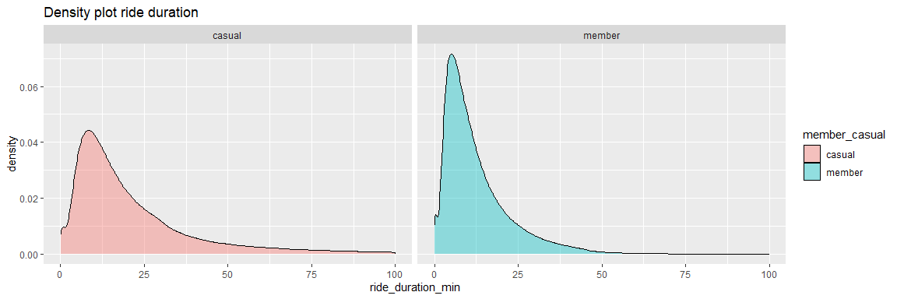

# Analyze

Just as a reminder, the business task is the following:

How do annual members and casual riders use Cyclistics bikes differently?

## Basic information

Fist some basic analysis will be done, starting with the split in number of rides per member and casual rider as well as the number of minutes on the bike.

### Number of rides
```{r pie_number_of_rides}
df <- bike_rides_2021 %>% 
  group_by(member_casual) %>% 
  tally(name = "number_of_rides") %>% 
  mutate(percentage = round(number_of_rides / sum(number_of_rides), digits = 2)) %>% 
  arrange(-percentage) %>% 
  mutate(labels = scales::percent(percentage))

ggplot(df, aes(x = "", y = percentage, fill = member_casual)) +
  geom_col(color = "white") +
  geom_text(aes(label = labels),
            position = position_stack(vjust = 0.5)) +
  coord_polar(theta = "y") +
  theme_void() + 
  labs(title = "Rides [5,585,206] per customer type") +
  guides(fill = guide_legend(title = "Member type"))
```


### Number of minutes on bike

```{r}
df <- bike_rides_2021 %>% 
  group_by(member_casual) %>% 
  summarise(minutes_on_bike = sum(ride_duration_min)) %>% 
  mutate(percentage = minutes_on_bike / sum(minutes_on_bike)) %>%
  arrange(percentage) %>% 
  mutate(labels = scales::percent(percentage))

ggplot(df, aes(x = "", y = percentage, fill = member_casual)) +
  geom_col(color = "white") +
  geom_text(aes(label = labels),
            position = position_stack(vjust = 0.5)) +
  coord_polar(theta = "y") +
  theme_void() + 
  labs(title = "Minutes [116.5 million] per customer type") +
  guides(fill = guide_legend(title = "Member type"))
```


#### Conclusions
* Members make more rides than casual riders
* Casual riders spend more minutes on the bike then members

## Starting the bike ride

When do the different customer types start their bike ride? On which day and hour? This section will dive into the when the ride was started.

### Day of the bike ride

Plotting the starting day in a bar graph. Week days need to be in a vector to make sure that the bar graoh shows the week days in the correct order.

```{r number_rides_week_day}
week_days <- c("Monday", "Tuesday", "Wednesday", "Thursday", "Friday", "Saturday", "Sunday")

bike_rides_2021 %>%
  ggplot() +
  geom_bar(mapping = aes(x = factor(week_day_started, level = week_days))) +
  facet_wrap(~member_casual) +
  theme(axis.text.x = element_text(angle = 45, hjust = 1)) +
  labs(title = "Number of bike rides", x = "Weekday", y = "Number of rides")
```


### Starting hour of the bike ride

Since there is a clear distinction between the week and the weekend the starting hours are separately plotted by week and weekend.

```{r fig.width=12,fig.height=4}

df <- bike_rides_2021 %>% 
  count(member_casual, hour_started, weekend, name = "number_bike_rides")

ggplot(data = df, aes(x = hour_started, y = number_bike_rides)) +
  geom_line(aes(color = member_casual)) +
  scale_x_continuous(breaks = seq(0, 23, by = 1)) +
  scale_y_continuous(labels = comma) +
  facet_wrap(~weekend) +
  labs(title = "Number of bike rides", color = "Member type")

```


### Starting hour during the week

Analysis of the starting hour during the week displayed per day

```{r fig.width=12,fig.height=4}
df <- bike_rides_2021 %>% 
  filter(week_day_started != "Saturday" & week_day_started != "Sunday") %>% 
  count(member_casual, week_day_started, hour_started, name = "number_bike_rides")

ggplot(data = df, aes(x = hour_started, y = number_bike_rides)) +
  geom_line(aes(color = week_day_started)) + 
  scale_x_continuous(breaks = seq(0, 23, by = 1)) +
  scale_y_continuous(labels = comma) +
  labs(title = "Number of bike rides during work week") +
  facet_wrap(~member_casual)
```


No significant observations besides some preferences in days can be found. Casual riders ride a bit more on Friday during the week. Member riders show a slight preference on Tuesday and Wednesday. 

### Starting hour during the weekend

Analysis of the starting hour during the weekend displayed per day

```{r fig.width=12,fig.height=4}
df <- bike_rides_2021 %>% 
  filter(week_day_started == "Saturday" | week_day_started == "Sunday") %>% 
  count(member_casual, week_day_started, hour_started, name = "number_bike_rides")

ggplot(data = df, aes(x = hour_started, y = number_bike_rides)) +
  geom_line(aes(color = week_day_started)) + 
  scale_x_continuous(breaks = seq(0, 23, by = 1)) +
  scale_y_continuous(labels = comma) +
  labs(title = "Number of bike rides during weekend") +
  facet_wrap(~member_casual)
```


No significant observations besides both the casual and member riders show a slight increase in rides on Saturday.

### Starting month 

```{r}
df <- bike_rides_2021 %>% 
  mutate(month_started = month(started_at)) %>% 
  count(member_casual, month_started, name = "number_bike_rides")

ggplot(data = df, aes(x = month_started, y = number_bike_rides)) +
  geom_line(aes(color = member_casual)) +
  scale_x_continuous(breaks = seq(0, 23, by = 1)) +
  scale_y_continuous(labels = comma) +
  labs(title = "Number of bike rides per month")
```


Member riders show that they ride longer throughout autumn. Where we see a sharp decrease in the casual riders when the weather turns for the worse. During the winter season there are a lot less bike rides especially for the casual riders. Membership riders also start earlier with riding in the beginning of the year. Casual riders show more rides during the summer period. Winters are often cold -10 C with snow. 

### Conclusions
* Casual riders make more rides during the weekend (including Friday)
* Member riders make less rides on Sunday and Monday than on average
* Member riders show clear morning and evening rush hour peaks during the week
* Casual riders only show a peak during the evening rush hour
* Member riders ride more during the week
* Casual riders rider more during the weekend
* Casual and member riders show similar riding patterns during the weekend
* Member riders ride more in the colder months whereas the casual rider likes the warmer months

## Ride duration

### Density plots

Plotting a density chart with the ride duration data shows that there are a few outliers that prevent the plot from being rendered correctly.


Filtering out rides that take more than 100 minutes gives a better plot.

```{r fig.width=12,fig.height=4}
df <- bike_rides_2021 %>%
  filter(ride_duration_min < 100)

ggplot(data = df, aes(x = ride_duration_min, fill = member_casual)) +
  geom_density(alpha=0.4) +
  facet_wrap(~member_casual)
```


Looking at the longer bike rides shows the following

```{r}
long_bike_rides <- bike_rides_2021 %>% 
  filter(ride_duration_min >= 100) %>% 
  group_by(member_casual) %>% 
  tally(name = "number_of_rides") %>% 
  mutate(percentage = percent(number_of_rides / sum(number_of_rides)), 
         percentage_total_rides = percent(number_of_rides / nrow(bike_rides_2021)))
```


Roughly 1.5% of all bike rides are longer than 100 minutes, where 92% of those longer rides are performed by casual rides. Although members are incentivized to stop their ride after 45 minutes ($0,15 cent per minute after 45 min), about 1% of their rides are longer than 45 minutes. Casual riders need to pay the 15 cents after 30 minutes, which is about 11% of their rides. But since there are also day passes available, and this information is not available in the data set, we cannot draw any conclusions from this.

### Average ride duration

```{r casual riders fig.width=12,fig.height=4}
df <- bike_rides_2021 %>% 
  filter(ride_duration_min < 100, member_casual == "casual")

mean_casual_min <- df %>% 
  pull(ride_duration_min) %>% 
  mean() %>% 
  round(2)

median_casual_min <- df %>% 
  pull(ride_duration_min) %>% 
  median() %>%
  round(2)

ggplot(data = df, aes(x = ride_duration_min)) +
  geom_density(alpha=0.4, fill = "dodgerblue") +
  labs(title = "Density plot casual riders") +
  geom_vline(xintercept = mean_casual_min, linetype = "longdash") +
  geom_vline(xintercept = median_casual_min, linetype = "longdash") +
  annotate("text", x=24, y=0.025, label= paste0("Mean\n",mean_casual_min)) +
  annotate("text", x=12, y=0.025, label= paste0("Median\n",median_casual_min)) +
  labs(title = "Density plot ride duration casual")
```


```{r casual riders fig.width=12,fig.height=4}
df <- bike_rides_2021 %>% 
  filter(ride_duration_min < 100, member_casual == "member")

mean_member_min <- df %>% 
  pull(ride_duration_min) %>% 
  mean() %>% 
  round(2)

median_member_min <- df %>% 
  pull(ride_duration_min) %>% 
  median() %>%
  round(2)

ggplot(data = df, aes(x = ride_duration_min)) +
  geom_density(alpha=0.4, fill = "dodgerblue") +
  labs(title = "Density plot member riders") +
  geom_vline(xintercept = mean_member_min, linetype = "longdash") +
  geom_vline(xintercept = median_member_min, linetype = "longdash") +
  annotate("text", x=15.5, y=0.04, label= paste0("Mean\n",mean_member_min)) +
  annotate("text", x=6, y=0.04, label= paste0("Median\n",median_member_min)) +
  labs(title = "Density plot ride duration members")
```


### Conclusions
* 92% of the rides longer than 100 minutes are performed by casual riders.


## Conclusions
* Members make more rides than casual riders
* Casual riders spend more minutes on the bike then members

## More data needed
* Divide the casual members in to regular and day pass.
