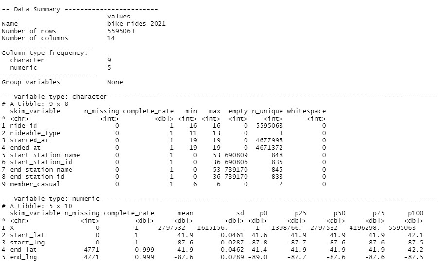
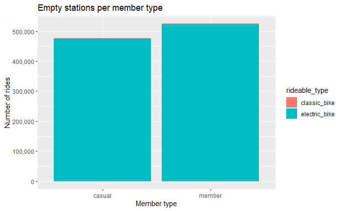

# Prepare

The data has been made available by Lyft Bikes and Scooters, LLc which operates the City of Chicago's Divvy bicycle sharing service. Some of the data, that is owned by the City of Chicago, has been made publicly available. The data is considered to be first party data and free from any privacy data. The licence for the data can be found here <https://ride.divvybikes.com/data-license-agreement>

Only the data from 2020 is used during this analysis. Data can be found here <https://divvy-tripdata.s3.amazonaws.com/index.html> and the data of each month is contained in a separate file.

The data has been combined into one file without altering its contents using rbind() in R.



The data set contains 5,559,063 observations containing 14 columns, which are all unique given their ride ID being unique for the whole data set.

## Column names

Short description of the column names.

|Column name           |Data type     |   Description                                                      | 
|:-------------        |:-------------|:-------------------------------------------------------------------| 
| ride_id              | character    |unique string of characters and numbers used as primary key         |
| rideable_type        | character    |type of ride(bikes in this case) that is used                       |
| started_at           | character    |date time when the ride started                                     |
| ended_at             | character    |date time when the ride ended                                       |
| start_station_name   | character    |name of the station where the bike ride started                     |
| start_station_id     | character    |identification code of the station where the bike ride started      |
| end_station_name     | character    |name of the station where the bike ride ended                       |
| end_station_id       | character    |identification code of the the station where the bike ride ended    |
| member_casual        | character    |indication of the ride was done by a annual member or a casual rider|
| start_lat            | number       |latitude position of where the bike ride started                    |
| start_long           | number       |longitude position of where the bike rider started                  |
| end_lat              | number       |latitude position of where the bike ride ended                      |
| end_long             | number       |longitude position of where the bike ride ended                     |

## Missing values

The data summary shows that the 4771 observations with missing geographical data for the end station. Besides this the data set is also missing the end_station_id and end_station_name. So these bike rides started at docking station and where never located anymore. Since the unique bike id is missing it is impossible to know what happened with these bikes, maybe they got stolen or ended sleeping with the fishes in lake Michigan. Given the relative small amount of NA's (4771) they will be removed from the data set.

Furthermore, there are more than a million observations that are empty("") at one or more of the following columns:

* start_station_name
* start_station_id
* end_station_name
* end_station_id

Given the size of the data that has empty values, a deeper analysis is warranted.

Filtering and plotting the data.

```{r filter_empty_stations}
empty_stations <- bike_rides_2021 %>%
  filter(start_station_id == "" | end_station_id == "")

empty_stations %>% 
  ggplot() +
  geom_bar(mapping = aes(x = member_casual, fill = rideable_type)) +
  scale_y_continuous(labels = comma) +
  labs(title = "Empty stations per member type", x = "Member type", y = "Number of rides")
```


The majority of the observations is missing either start or end station information. It is noticeable that although no station_id are present, there is geographical information present. Gathering information on the Divvy website about how the use the bikes revealed the following information:

* Classic bikes can be picked up from docking station and must be returned at a docking station
* E-bikes can be picked up from anywhere (docking station or any legal bike parking location). Riders are encouraged to return the bike to a docking station but can leave their bike at any legal bike parking location at an additional cost of $2.

This means that for E-bike ride it is perfectly okay if there is no station identification and name as long as there is geographical information about the start and end positions. So nothing to worry about here. However, there are also a small amount (4563 observations) of classic bikes without station information. Since it is not possible to park a normal bike outside a docking station and it is a relative small amount of observation they will be deleted from the data set.


## Data cleaning remarks

* Combined separate data files into one file using rbind()
* Removed observations where the geographical data was NA.(removed 4771 obs)
* Removed classic_bike rides where there was no end station id (removed 4563 obs)