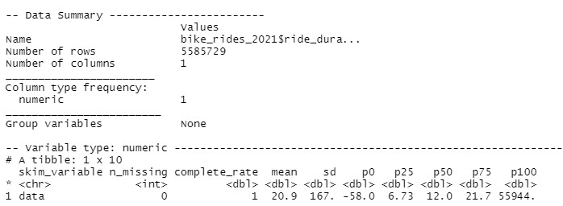
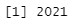

# Process

## Ride duration

The first task is to calculate the ride duration in minutes. This can be done by subtracting the started_at form the ended_at times. These times are currently stored as a character data type and need to be converted to a datetime data type (POSIXct). After calculating the ride duration the value is stored as a difftime data type. It needs to be cast to number in order to work with it in the future.


```{r convert_date_time}
bike_rides_2021 <- bike_rides_2021 %>% 
  mutate(started_at = as_datetime(started_at), ended_at = as_datetime(ended_at),
         ride_duration_min = as.numeric(difftime(ended_at, started_at, units = "mins")))
```



It is noticeable that there are rides with a negative ride duration (146 observations) and rides that took exactly 0 minutes to complete (377 observations). 

```{r negative_zero_duration}
negative_duration <- bike_rides_2021 %>% 
  filter(ride_duration_min < 0)

zero_duration <- bike_rides_2021 %>% 
  filter(ride_duration_min == 0)
```

These trips have been identified to have a incorrect duration and in total 523 have an incorrect trip duration and since this is a small amount they will be removed from the data set.

```{r removing_negative_zero_duration}
bike_rides_2021 <- anti_join(bike_rides_2021, negative_duration)
bike_rides_2021 <- anti_join(bike_rides_2021, zero_duration)
```

## Date and time

### Al rides started in 2021?
The first check is to see if all bike trips have started in 2021, and this is the case.

```{r in_2021}
unique(year(bike_rides_2021$started_at))
```


### Calculating the day of the week

Since my PC has Dutch date time settings, using the weekdays() function results in names of the day printed in Dutch. In order to change this to English without changing my language settings a vector needs to be created which can be used with the wday() function which returns a number for the day of the week.

```{r calculating_day_week}

week_days = c("Sunday", "Monday", "Tuesday", "Wednesday", "Thursday", 
    "Friday", "Saturday")

bike_rides_2021 <- bike_rides_2021 %>% 
  mutate(week_day_started = week_days[wday(started_at)])
```
### Calculating the hour when the ride started

Calculating the hour when the ride started

```{r calculating_hour}
bike_rides_2021 <- bike_rides_2021 %>% 
  mutate(hour_started = as.numeric(hour(started_at)))
```

### Calculating whether or not it is weekend

```{r bool_weekend}
bike_rides_2021 <- bike_rides_2021 %>% 
  mutate(weekend = case_when(week_day_started == "Saturday" ~ "Weekend", 
                             week_day_started == "Sunday" ~ "Weekend",
                             TRUE ~ "Week"))

```

## Other

### Calculating the distance between start and end stations

In order to calculate the distance between the two stations the distHaversine() function of the geosphere package is used. Rowwise() needs to be applied since distHaverine() cannot handle all data at one and must be fed row wise.

```{r distance_between_stations}
bike_rides_2021 <- bike_rides_2021 %>% 
  rowwise() %>% 
  mutate(distance_between_stations_km = distHaversine(c(start_lng, start_lat), c(end_lng, end_lat)) / 1000)

```

### Writing the data to a csv file

I found out that it is good practice to save your clean data to a csv file so you can load the cleaned data in one step in stead of loading the raw data and performing all the cleaning and transformations. :)

```{r writ_to_csv}
write.csv(bike_rides_2021,"bike_rides_2021_cleaned.csv", row.names = TRUE)
```

## Data transformations
* Converted started_at en ended_at to date time with as_datetime()
* Calculated the ride duration ride_duration_min with difftime() 
* Converted ride_duration_min to numeric data type


## Data calculations
* Calculated the day of the week and stored in column week_day_started
* Calculated the hour when the ride started and stored in hour_started
* Calculated whether it is weekend and stored boolean in column weekend
* Calculated the distance between start and end station with distHaversine() and stored in column distance_between_stations_km

## Data cleaning remarks
* Removed the bike rides with a with negative and zero time duration (removed 523 obs)